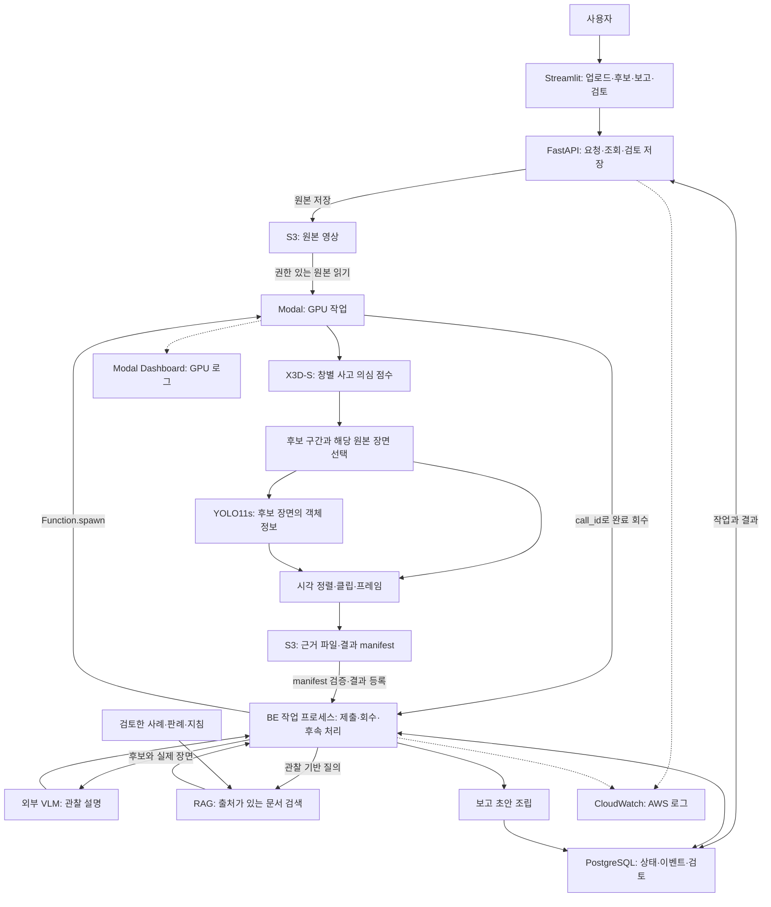

# CCTV 사고 의심 분석·검토 서비스 — PRD v0.2

작성일: 2026-09-26 · 용도: 팀 개발·발표 · 문서 상태: 사용자 선택 구성 반영, 세부 연결 규칙은 개발 기준 제안

## 1. 서비스 목표

녹화 CCTV에서 사고 의심 구간을 찾고, 실제 장면·AI 설명·관련 문서가 연결된 보고 초안을 제공한다. 담당자는 원본을 확인해 사고 확인·사고 아님·판단 보류를 기록한다.

관제 담당자는 확인할 구간을 찾고, 프로젝트 영상 검토자는 탐지 결과와 근거를 비교하며, 경찰·사고 대응 담당자는 출처가 있는 보고 초안을 검토한다. 세 사용자군을 대상으로 하되 첫 버전은 공통 검토 화면으로 제안한다. 사용자군별 별도 화면·권한 체계는 미정이다.

**이번 완료물은 PRD와 역할별 개발 문서다.** 새 서비스의 구현·배포·모델 품질 검증은 아직 완료되지 않았다. 별도 개발 환경의 R3D-18 실험, 읽기 전용 결과 화면, 합성 이벤트 시험은 참고 이력이며 YOLO11s/X3D-S 서비스 통합 성과와 구분한다.

## 2. 결정과 미정 항목

| 구분 | 현재 기준 |
|---|---|
| 사용자 선택 | Streamlit, FastAPI, S3, Modal 비동기 작업, YOLO11s(전달 체크포인트 7개 클래스), X3D-S, 외부 VLM, RAG, 보고 초안, 사람 검토, 작업 상태 DB, CloudWatch·Modal Dashboard |
| 서비스 범위 | 탐지·영상 확인 + VLM 설명 + 유사 사고·판례 등 RAG 문서 안내 + 보고 초안 |
| 개발 기준 제안 | 녹화 MP4 한 건씩 접수, X3D-S가 후보를 찾은 뒤 해당 원본 장면에 YOLO로 객체 정보를 추가, BE 작업 프로세스가 Modal 완료 회수와 후속 단계를 관리 |
| 저장·배포 제안 | S3 비공개 파일 보관, PostgreSQL 상태 저장, pgvector 문서 검색. Streamlit·FastAPI·BE 작업 프로세스는 AWS CPU 환경에 배치; 초기 단일 EC2 구성은 인프라 검토안 |
| 확인 필요 | Dynamic 클래스의 라벨 정의·표시 정책, 받은 모델 설정의 실제 동작 검증과 서비스 전처리/후처리 버전, VLM 업체, 확보한 RAG 원문, 영상 제한·수치 합격선·유료 사용 상한 |
| 팀 운영 | 사람 이름별 업무 배정은 하지 않는다. FE·BE·모델·VLM/RAG·인프라·QA의 산출물과 연결점만 나눈다 |

모델의 시간 창별 점수에서 의심 구간을 정리한다. 이 시각은 원본 영상의 상대 초이며 미래 사고 예측 시각이나 정확한 충돌 정답 시각을 뜻하지 않는다. 모델 점수를 검증된 사고 확률로 표시하지 않는다.

## 3. 첫 완성본의 범위

**포함**

- 영상 업로드 또는 등록된 영상 선택, 분석 요청, 상태 조회와 실패 사유 표시.
- YOLO 객체 정보와 X3D-S 창별 판정, 사고 의심 구간·원본 시각·대표 프레임·검토용 클립.
- 근거 영상 우선 열람, 후보가 있을 때 VLM 설명과 RAG 검색을 순차 보강.
- 영상 관찰·탐지 추정·문서 인용을 구분한 사고 분석 보고 초안.
- 사람 검토와 메모 저장, 새로고침·중복 요청·실패 후 재개를 고려한 기록.

**후속 검토**: RTSP 상시 감시, 여러 카메라 동시 운영, 기관 자동 전송·출동 연계, 사용자군별 세 화면, 자동 재학습, 고가용성 구성. STATS19와 부상·사망 정도 예측, 과실·사고 원인 확정은 현재 범위에 포함하지 않는다.

## 4. 서비스 구성

노드는 책임 구분이며 각각 서버 한 대를 뜻하지 않는다. FastAPI와 작업 프로세스는 같은 BE 코드·DB를 사용할 수 있다. GPU 작업이 끝난 뒤 CPU 후속 처리로 넘어가므로 VLM/RAG 응답을 기다리는 동안 GPU를 붙잡아 두지 않는 구성을 제안한다.

### 원래 그림에서 보완한 연결

1. **FastAPI가 작업을 접수하고 BE 프로세스가 Modal을 호출한다.** S3는 영상 보관소다. 초기 구성에 S3 업로드 이벤트 트리거를 추가하지 않는다.
2. **X3D-S는 후보 구간, YOLO는 객체 정보를 담당한다.** 사용자 답변에 맞춰 X3D-S가 원본 전체의 지정 범위를 분석하고, 후보 장면에 YOLO를 실행하는 순서를 제안한다. 원본 시각으로 결과를 결합하며 YOLO crop을 X3D 입력으로 넣지 않는다. 후보가 없으면 YOLO도 생략해 불필요한 연산을 줄인다.
3. **완료 회수를 추가한다.** BE가 `call_id`를 보관하고 Modal 결과 및 S3 manifest를 확인해 DB에 등록한다. 브라우저를 닫아도 이 작업은 BE가 이어가야 한다.
4. **검토 저장은 UI→API→DB다.** 화면이 DB를 직접 수정하지 않는다.
5. **CloudWatch와 Modal 로그는 별도다.** 공통 `job_id/run_id`로 대조한다. Modal 로그의 CloudWatch 자동 전송은 구축된 기능으로 표시하지 않는다.

Modal은 배포된 함수의 `spawn()`과 호출 ID를 통한 결과 조회를 지원한다. 이 PRD의 DB 작업 관리·회수·재시도 규칙은 그 기능 위에 제안한 서비스 설계다. [Modal 공식 작업 처리 문서](https://modal.com/docs/guide/job-queue).

## 5. 영상 한 건의 사용자 흐름

1. 사용자가 영상을 올리거나 기존 영상을 선택한다. 업로드 완료를 확인한 뒤 분석 버튼을 누른다.
2. API는 `job_id/run_id`를 발급하고 대기 상태를 반환한다. 화면은 작업 목록에서 다시 열 수 있다.
3. BE가 Modal 작업을 제출한다. 모델 버전·전처리·실제 분석 범위와 미분류 구간을 기록한다.
4. 모델 결과와 근거를 등록하면 후보 목록을 먼저 보여준다. 설명이 아직 없으면 ‘설명 준비 중’으로 표시한다.
5. 후보별 실제 클립 또는 여러 프레임을 VLM에 보내고, 설명과 검색 조건으로 관련 문서를 찾는다.
6. 설명·인용·부족한 근거를 합쳐 보고 초안을 저장한다. 한 단계 실패로 이미 나온 근거를 지우지 않는다.
7. 담당자는 원본과 설명을 확인하고 판단·메모를 저장한다. AI 초안과 사람의 판단은 따로 보존한다.

후보가 없으면 분석 범위와 함께 ‘분석된 범위에서 사고 의심 후보 없음’을 표시한다. 미분류나 미처리 범위가 있으면 부분 결과다. 처리 실패를 ‘사고 없음’으로 바꾸지 않는다.

## 6. 화면 요구

| 화면 영역 | 표시·동작 | 확인 기준 |
|---|---|---|
| 영상 접수·작업 목록 | 파일·등록 영상, 요청 버튼, 상태, 오류, 다시 열기 | 새로고침이 새 분석을 만들지 않음 |
| 분석 상세 | 원본/클립, 후보 시작·끝, 대표 프레임, 객체 정보, 미분류 범위 | 동일 `run_id`의 원본 시각과 근거가 연결됨 |
| 설명·문서·보고 | 준비/완료/실패 구분, 출처 링크·절, 불확실성 | 출처 없는 사실을 판례 근거처럼 쓰지 않음 |
| 사람 검토 | 사고 확인·사고 아님·판단 보류, 메모·검토 이력 | API 저장 후 다시 열어 동일 판단 확인 |

FE 상세는 [FE 문서](docs/roles/frontend.md), 필드·상태는 [공통 계약](docs/contracts/service_contract.md)을 따른다.

## 7. 데이터와 기능 완료 기준

- 파일은 S3, 영구 상태·메타데이터·검토 기록은 DB에 둔다. S3 URL 자체를 영구 식별자로 쓰지 않는다.
- Job, Run, Event, Asset, Report, Review를 구분한다. 재분석은 새 Run이며 이전 결과를 덮어쓰지 않는다.
- 기능 인수는 [QA 시나리오](docs/roles/validation.md)와 [요구사항](docs/requirements.md)을 기준으로 한다. 가상 응답 확인과 실제 모델 연결 시험을 따로 기록한다.
- 모델 품질은 같은 평가 목록·정답·전처리·판정 규칙으로 평가한다. 사건 Recall, 정상 시간당 오탐, 탐지 지연과 미분류율은 정의·정답이 갖춰진 범위에서만 보고한다. 합격 수치는 미정이다.
- 전체 처리시간을 업로드·대기·GPU 준비·추론·저장·VLM·RAG·보고 단계로 나눈다. 비용은 GPU 시간·외부 API 사용량·AWS 저장/전송/실행을 따로 측정한다. 예산·유료 실행 상한은 아직 정하지 않았다.
- 공개 배포 전 접속 통제·파일 접근·보관 기간·삭제와 백업 범위를 결정한다. 첫 시연은 제한된 팀 접근을 제안한다.

## 8. 개발 착수 순서와 문서 운영

1. 공통 계약·가상 응답으로 FE/BE가 접수→조회→검토 저장 흐름을 맞춘다.
2. 모델 담당은 받은 두 가중치·7개 클래스·전처리 명세를 기준으로 서비스 계약 변환과 결과 manifest를 준비한다.
3. S3/Modal 한 건 연결과 실패·중복·재시작 복구를 확인한다.
4. VLM/RAG·보고를 붙이고 후보만 있는 상태와 후속 실패 상태를 확인한다.
5. 실제 자료로 통합 시연과 별도의 품질 평가를 수행한다.

전체 읽기 순서·역할별 편집 방법은 [팀 공유 안내](docs/team_handoff.md), 실행 TODO는 [계획](IMPLEMENTATION_PLAN.md), 실제 완료 상태는 [현재 상태](docs/current_status.md)에 둔다. API·상태를 바꾸면 역할 문서에서 각각 정의하지 않고 공통 계약을 먼저 바꾼다.

## 9. 이번 변경 기록

수동 Colab 연결·React 제안에서 사용자 최신 그림의 Streamlit·Modal·YOLO11s·X3D-S 설계로 개정했다. RAG와 사람 검토는 첫 완성본 범위에 반영했다. R3D-18 기존 평가·다음 실험 TODO는 별도 실험 저장소에 보존한다. 모델 선택 변경은 성능 우위나 운영 적합성을 입증하지 않는다.

지정한 deployment_handoff에서 YOLO .pt의 7개 클래스·두 가중치 해시·X3D epoch 7/임계값 0.5를 정적 확인했다. 원래 그림의 6개 표기를 실제 파일 기준 7개로 수정했다. Dynamic의 뜻과 표시 정책은 추가 확인이 필요하다. 모델 로딩·추론·통합 품질은 미검증이다. 계속해서 공통 계약·가상 응답을 사용한 문서 검토와 화면 설계는 가능하다.
