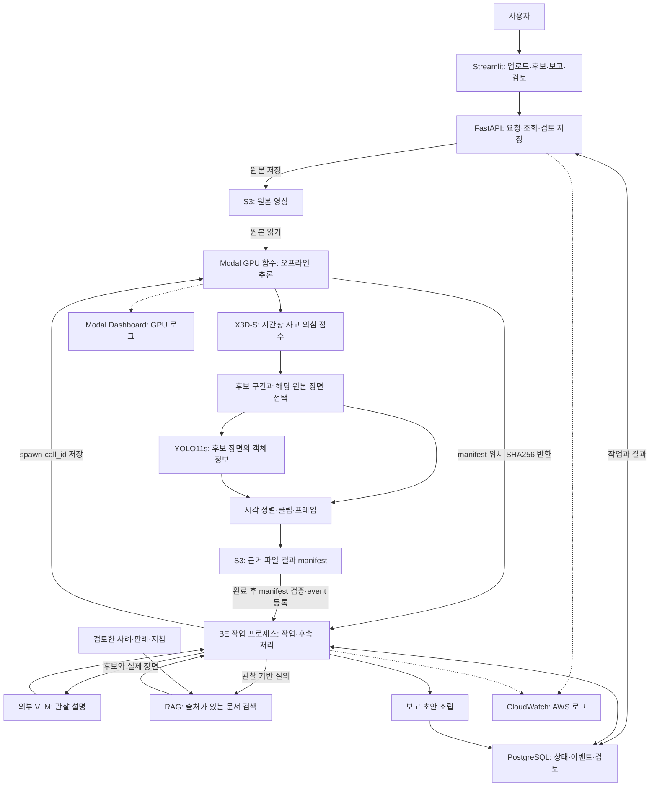

# CCTV 사고 의심 분석·검토 서비스 — PRD v0.2

작성일: 2026-09-26 · 용도: 팀 개발·발표 · 문서 상태: 사용자 선택 구성 반영, 세부 연결 규칙은 개발 기준 제안

## 1. 서비스 목표

녹화 CCTV에서 사고 의심 구간을 찾고, 실제 장면·AI 설명·관련 문서가 연결된 보고 초안을 제공한다. 담당자는 원본을 확인해 사고 확인·사고 아님·판단 보류를 기록한다.

관제 담당자는 확인할 구간을 찾고, 프로젝트 영상 검토자는 탐지 결과와 근거를 비교하며, 경찰·사고 대응 담당자는 출처가 있는 보고 초안을 검토한다. 세 사용자군을 대상으로 하되 첫 버전은 공통 검토 화면으로 제안한다. 사용자군별 별도 화면·권한 체계는 미정이다.

PRD와 역할별 개발 문서를 기준으로 FastAPI·Streamlit·Modal 함수 코드를 작성했다. 실제 클라우드 배포·GPU 추론·모델 품질 검증은 아직 완료되지 않았다. 별도 개발 환경의 R3D-18 실험, 읽기 전용 결과 화면, 합성 이벤트 시험은 참고 이력이며 YOLO11s/X3D-S 서비스 통합 성과와 구분한다.

## 2. 결정과 미정 항목

| 구분 | 현재 기준 |
|---|---|
| 사용자 선택 | Streamlit, FastAPI, S3, Modal GPU 비동기 함수, YOLO11s(전달 체크포인트 7개 클래스), X3D-S, Gemini VLM, RAG, 보고 초안, 사람 검토, PostgreSQL, CloudWatch·Modal Dashboard |
| 서비스 범위 | 탐지·영상 확인 + VLM 설명 + 유사 사고·판례 등 RAG 문서 안내 + 보고 초안 |
| 현재 개발 기준 | 업로드한 MP4를 Modal 함수가 오프라인으로 분석한다. X3D-S 후보를 찾은 뒤 후보 장면 한 프레임에 YOLO 객체 정보를 붙인다. 후보 clip·frame·manifest를 S3에 저장하고, 함수 완료 후 백엔드가 검증해 DB에 등록한다. |
| 저장·배포 제안 | S3 비공개 파일 보관, PostgreSQL 상태 저장, 필요 시 pgvector 문서 검색. Streamlit·FastAPI·BE 작업 프로세스는 초기 EC2 Compose에서 실행하고 GPU 추론은 Modal에서 실행 |
| 확인 필요 | Dynamic 클래스의 라벨 정의·표시 정책, 실제 GPU 추론과 서비스 전처리/후처리 검증, RAG 원문과 검색 방식, 영상 제한·수치 합격선·유료 사용 상한 |
| 팀 운영 | 사람 이름별 업무 배정은 하지 않는다. FE·BE·모델·VLM/RAG·인프라·QA의 산출물과 연결점만 나눈다 |

모델의 시간 창별 점수에서 의심 구간을 정리한다. 이 시각은 원본 영상의 상대 초이며 미래 사고 예측 시각이나 정확한 충돌 정답 시각을 뜻하지 않는다. 모델 점수를 검증된 사고 확률로 표시하지 않는다.

### 업로드 영상 분석의 의미

첫 시연은 실제 CCTV 연결이나 재생속도 1× 실시간 탐지가 아니다. 업로드한 MP4 전체를 Modal에서 오프라인으로 처리한다. 후보와 근거는 함수 완료 후 백엔드가 S3 결과를 검증해 표시한다. 실시간 스트림과 분석 도중의 부분 이벤트 표시는 별도 개발 범위다.

## 3. 첫 완성본의 범위

**포함**

- 영상 업로드 또는 등록된 영상 선택, 분석 요청, 상태 조회와 실패 사유 표시.
- YOLO 객체 정보와 X3D-S 창별 판정, 사고 의심 구간·원본 시각·대표 프레임·검토용 클립.
- 근거 영상 우선 열람, 후보가 있을 때 VLM 설명과 RAG 검색을 순차 보강.
- 영상 관찰·탐지 추정·문서 인용을 구분한 사고 분석 보고 초안.
- 사람 검토와 메모 저장, 새로고침·중복 요청·실패 후 재개를 고려한 기록.

**후속 검토**: RTSP 상시 감시, 여러 카메라 동시 운영, 기관 자동 전송·출동 연계, 사용자군별 세 화면, 자동 재학습, 고가용성 구성. STATS19와 부상·사망 정도 예측, 과실·사고 원인 확정은 현재 범위에 포함하지 않는다.

## 4. 서비스 구성

노드는 책임 구분이며 각각 서버 한 대를 뜻하지 않는다. FastAPI와 작업 프로세스는 같은 BE 코드·DB를 사용할 수 있다. GPU 작업이 끝난 뒤 CPU 후속 처리로 넘어가므로 VLM/RAG 응답을 기다리는 동안 GPU를 붙잡아 두지 않는 구성을 제안한다.

### 원래 그림에서 보완한 연결

1. **Modal GPU 함수는 작업별로 비동기 실행한다.** BE 작업 프로세스가 `spawn()`으로 제출하고 `modal_call_id`를 DB에 저장한다. 실제 CCTV/RTSP 연결은 이번 시연 범위에 포함하지 않는다.
2. **X3D-S는 후보 구간, YOLO는 객체 정보를 담당한다.** 사용자 답변에 맞춰 X3D-S가 원본 전체의 지정 범위를 분석하고, 후보 장면에 YOLO를 실행하는 순서를 제안한다. 원본 시각으로 결과를 결합하며 YOLO crop을 X3D 입력으로 넣지 않는다. 후보가 없으면 YOLO도 생략해 불필요한 연산을 줄인다.
3. **함수 결과와 영구 상태를 분리한다.** Modal은 근거와 manifest를 S3에 저장하고 경로·SHA256을 반환한다. BE가 완료를 확인하고 S3 객체를 검증해 event를 DB에 등록한다. 브라우저를 닫아도 작업과 결과가 유지되어야 한다.
4. **검토 저장은 UI→API→DB다.** 화면이 DB를 직접 수정하지 않는다.
5. **CloudWatch와 Modal 로그는 별도다.** 공통 `job_id/run_id/event_id`와 `modal_call_id`로 대조한다. Modal 로그의 CloudWatch 자동 전송은 구축된 기능으로 표시하지 않는다.

현재 기준은 Modal GPU 함수다. 함수의 임시 디스크를 영구 저장소로 간주하지 않는다. 원본·후보 클립·manifest는 S3, 영구 상태는 PostgreSQL을 기준으로 한다. 실제 비용과 처리시간은 통합 실행 후 측정한다.

## 5. 영상 한 건의 사용자 흐름

1. 사용자가 영상을 올리거나 기존 영상을 선택한다. 업로드 완료를 확인한 뒤 분석 버튼을 누른다.
2. API는 업로드 완료 후 분석 요청에 `job_id/run_id`를 발급한다. 화면은 작업 목록에서 다시 열 수 있다.
3. BE 작업 프로세스가 Modal 함수를 제출하고 `modal_call_id`를 저장한다. Modal은 MP4 전체를 분석해 후보 clip·frame·manifest를 S3에 저장한다.
4. BE가 함수 완료와 S3 결과를 검증한 후 후보 목록을 등록한다. 설명이 아직 없으면 ‘설명 준비 중’으로 표시한다.
5. 후보별 실제 클립 또는 여러 프레임을 VLM에 보내고, 설명과 검색 조건으로 관련 문서를 찾는다.
6. 설명·인용·부족한 근거를 합쳐 보고 초안을 저장한다. 한 단계 실패로 이미 나온 근거를 지우지 않는다.
7. 담당자는 원본과 설명을 확인하고 판단·메모를 저장한다. AI 초안과 사람의 판단은 따로 보존한다.

후보가 없으면 분석 범위와 함께 ‘분석된 범위에서 사고 의심 후보 없음’을 표시한다. 미분류나 미처리 범위가 있으면 부분 결과다. 처리 실패를 ‘사고 없음’으로 바꾸지 않는다.

## 6. 화면 요구

| 화면 영역 | 표시·동작 | 확인 기준 |
|---|---|---|
| 영상 접수·작업 목록 | 파일·등록 영상, 요청 버튼, 상태, 오류, 다시 열기 | 새로고침이 새 분석을 만들지 않음 |
| 분석 상세 | 원본/클립, 후보 시작·끝, 대표 프레임, 객체 정보, 미분류 범위 | 동일 `run_id`의 원본 시각과 근거가 연결됨 |
| 설명·문서·보고 | 준비/완료/실패 구분, 출처 링크·절, 불확실성 | 출처 없는 사실을 판례 근거처럼 쓰지 않음 |
| 사람 검토 | 사고 확인·사고 아님·판단 보류, 메모·검토 이력 | API 저장 후 다시 열어 동일 판단 확인 |

FE 상세는 [FE 문서](docs/roles/frontend.md), 필드·상태는 [공통 계약](docs/contracts/service_contract.md)을 따른다.

## 7. 데이터와 기능 완료 기준

- 파일은 S3, 영구 상태·메타데이터·검토 기록은 DB에 둔다. S3 URL 자체를 영구 식별자로 쓰지 않는다.
- Job, Run, Event, Asset, Report, Review를 구분한다. 재분석은 새 Run이며 이전 결과를 덮어쓰지 않는다.
- 기능 인수는 [QA 시나리오](docs/roles/validation.md)와 [요구사항](docs/requirements.md)을 기준으로 한다. 가상 응답 확인과 실제 모델 연결 시험을 따로 기록한다.
- 모델 품질은 같은 평가 목록·정답·전처리·판정 규칙으로 평가한다. 사건 Recall, 정상 시간당 오탐, 탐지 지연과 미분류율은 정의·정답이 갖춰진 범위에서만 보고한다. 합격 수치는 미정이다.
- 전체 처리시간을 업로드·대기·GPU 준비·추론·저장·VLM·RAG·보고 단계로 나눈다. 비용은 GPU 시간·외부 API 사용량·AWS 저장/전송/실행을 따로 측정한다. 예산·유료 실행 상한은 아직 정하지 않았다.
- 공개 배포 전 접속 통제·파일 접근·보관 기간·삭제와 백업 범위를 결정한다. 첫 시연은 제한된 팀 접근을 제안한다.

## 8. 개발 착수 순서와 문서 운영

1. 공통 계약·가상 응답으로 FE/BE가 접수→조회→검토 저장 흐름을 맞춘다.
2. 모델 담당은 받은 두 가중치·7개 클래스·전처리 명세를 기준으로 서비스 계약 변환과 결과 manifest를 준비한다.
3. 한 업로드 영상의 S3→Modal 오프라인 분석→S3 manifest→BE 결과 등록과 실패·중복·재시작 복구를 확인한다.
4. VLM/RAG·보고를 붙이고 후보만 있는 상태와 후속 실패 상태를 확인한다.
5. 실제 자료로 통합 시연과 별도의 품질 평가를 수행한다.

전체 읽기 순서·역할별 편집 방법은 [팀 공유 안내](docs/team_handoff.md), 실행 TODO는 [계획](IMPLEMENTATION_PLAN.md), 실제 구현 요약은 [README 현재 상태](README.md#현재-상태), 검증 기록은 [진행 기록](docs/PROGRESS.md)에 둔다. API·상태를 바꾸면 역할 문서에서 각각 정의하지 않고 공통 계약을 먼저 바꾼다.

## 9. 이번 변경 기록

수동 Colab 연결·React 제안에서 Streamlit·YOLO11s·X3D-S 설계로 개정했고, 현재 GPU 실행 계층은 Modal 비동기 함수로 정했다. RAG와 사람 검토는 목표 범위에 반영했으나 RAG 연결은 아직 미구현이다. R3D-18 기존 평가·다음 실험 TODO는 별도 실험 저장소에 보존한다. 모델 또는 GPU 제공자 변경은 성능 우위나 운영 적합성을 입증하지 않는다.

지정한 deployment_handoff에서 YOLO .pt의 7개 클래스·두 가중치 해시·X3D epoch 7/임계값 0.5를 정적 확인했다. 원래 그림의 6개 표기를 실제 파일 기준 7개로 수정했다. Dynamic의 뜻과 표시 정책은 추가 확인이 필요하다. 모델 로딩·추론·통합 품질은 미검증이다. 계속해서 공통 계약·가상 응답을 사용한 문서 검토와 화면 설계는 가능하다.
