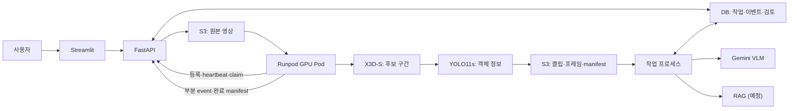

# CCTV Accident Detector

녹화된 CCTV 영상에서 **사고 의심 구간**을 찾고, 실제 장면·AI 설명·관련 문서를 묶은 **보고 초안**을 만든 뒤, 담당자가 원본을 보고 `사고 확인 / 사고 아님 / 판단 보류`를 기록하는 서비스입니다.

- 대상 사용자: 관제 담당자, 영상 검토자, 경찰·사고 대응 담당자 (첫 버전은 공통 검토 화면 하나)
- 목표와 범위 전체: [PRD v0.2](PROJECT_BRIEF.md)

## 현재 상태

| 영역 | 상태 |
| --- | --- |
| 설계 문서 | PRD, 공통 API·데이터 계약, 역할 문서 6종, 가상 응답 8종 |
| 화면 (`apps/streamlit/`) | FastAPI 영상 접수·작업 조회·원본/근거 자산·검토 저장 연결. 환경 변수 없이 가상 응답 데모도 가능 |
| 백엔드 (`services/backend/`) | 공개 API, Pod 내부 API, S3 manifest 검증, Gemini 설명 저장의 로컬 개발 구현. 테스트는 가짜 S3·Pod·Gemini 사용 |
| 모델 추론 | **저장소에 없음.** 인계받은 YOLO11s·X3D-S 가중치는 해시와 클래스 수만 정적으로 확인했고, 로드·추론은 검증 전 |
| Runpod GPU worker | 미구현. 백엔드에 Pod가 호출할 API만 있음 |
| RAG 문서 저장소 | 미연결. 항상 `insufficient_evidence/corpus_not_configured`로 표시 |

그래서 지금은 **실제 영상에서 사고를 탐지할 수 없습니다.** 화면과 API에서 영상 접수, 작업 생성·조회, 검토 저장은 가능합니다. 최신 상황은 [현재 상태](docs/current_status.md)와 [구현 계획](IMPLEMENTATION_PLAN.md)을 참고하세요.

## 동작 방식

영상 한 건은 다음 순서로 처리하도록 설계했습니다.

1. 사용자가 MP4를 업로드하고 분석을 요청하면 API가 `job_id / run_id`를 발급합니다.
2. 상시 실행 중인 Runpod GPU Pod가 작업을 가져가(claim) 영상을 **원본 속도(1×)로 처음부터** 읽습니다. 현재 재생 시각까지의 프레임만 쓰는 파일 기반 "실시간" 시연입니다.
3. **X3D-S**가 시간 창마다 사고 의심 점수를 계산해 후보 구간을 찾습니다.
4. 후보가 있을 때만 해당 장면에 **YOLO11s**(7개 클래스)를 실행해 객체 정보를 붙입니다.
5. Pod는 클립·대표 프레임·manifest를 S3에 저장하고, 분석이 끝나기 전에도 후보 event를 API에 등록합니다.
6. 백엔드의 별도 작업 프로세스가 검증된 클립·프레임을 **Gemini**(VLM)에 보내 장면 설명을 받고, **RAG**로 출처 있는 사례·판례·지침을 찾아 보고 초안을 만듭니다.
7. 담당자가 원본과 설명을 확인하고 판단·메모를 저장합니다. AI 초안과 사람의 판단은 따로 보존합니다.

모델 점수는 검증된 사고 확률이 아니며, 표시되는 시각은 원본 영상 기준 초입니다. 처리 실패나 미처리 범위를 "사고 없음"으로 표시하지 않습니다.

## 아키텍처



| 구성 요소 | 역할 | 코드 |
| --- | --- | --- |
| Streamlit | 영상 접수, 작업 목록, 후보·보고 확인, 사람 검토 | `apps/streamlit/app.py` |
| FastAPI | 공개 API(`/api/v1/*`)와 Pod 내부 API(`/internal/v1/*`), 인증·멱등성 | `services/backend/app.py` |
| Pod 연동 | worker 등록·lease, manifest와 S3 객체 SHA256 검증, 후보 등록 | `services/backend/pod.py` |
| 작업 프로세스 | Gemini 설명 생성과 저장 | `services/backend/worker.py`, `run_worker.py` |
| 추론 패키지 | 로컬과 Pod가 함께 쓸 YOLO·X3D-S 파이프라인 (예정) | `src/accident_vision/` |
| 저장소 | S3는 원본·근거 파일, PostgreSQL은 영상 메타데이터·작업·검토, SQLite는 테스트 | `storage.py`, `db.py`, `migrations/` |

자세한 연결 규칙은 [PRD 4장](PROJECT_BRIEF.md#4-서비스-구성), API는 [공통 계약](docs/contracts/service_contract.md)과 [HTTP API 명세](docs/contracts/api-spec-v0.2.md), VLM 출력 형식은 [VLM → RAG 입력 계약](docs/contracts/vlm-rag-input-v1.md)을 참고하세요.

## 실행 안내

### 1. 설치와 테스트

Python 3.13과 [uv](https://docs.astral.sh/uv/getting-started/installation/)를 설치한 뒤 저장소 루트에서 실행합니다. `uv sync`가 `.python-version`에 맞는 Python과 `.venv`를 준비하고, `uv.lock`에 고정된 버전을 설치합니다.

```bash
git switch develop
git pull --ff-only
uv sync --locked --group dev
uv run --locked pytest -q
```

테스트는 SQLite와 가짜 S3·Pod·Gemini·ffprobe를 쓰므로 클라우드 계정이나 API 키 없이 실행됩니다.

### 2. Streamlit 화면

환경 변수 없이 실행하면 가상 응답(`docs/contracts/demo-analysis-cases-v0.2.json`)으로 화면 흐름을 확인합니다. `BACKEND_API_URL`과 `APP_API_KEY`를 설정하면 FastAPI를 통해 영상을 S3에 접수하고 작업·검토를 PostgreSQL에 저장합니다.

```bash
uv run --locked --group dev streamlit run apps/streamlit/app.py
```

브라우저에서 `http://localhost:8501`을 엽니다.

- 로컬 영상을 최대 5개까지 올리면 영상 카드 목록이 나오고, 카드를 누르면 분석 화면으로 이동합니다.
- 분석 화면에서 가상 응답 8종(대기, 분석 중, 후보 없음, 부분 완료, 설명 생성 중, 문서 근거 부족, VLM 실패, 전체 실패)을 바꿔 볼 수 있습니다.
- API 모드에서는 작업과 검토 결과를 DB에 저장하며, 데모 모드에서는 검토 결과를 현재 세션에만 저장합니다.

화면과 API의 로컬 연결 범위는 [Streamlit–FastAPI 연동 안내](docs/STREAMLIT_BACKEND_LOCAL.md)에 있습니다.

### 3. 백엔드 API 로컬 실행

로컬에서는 PostgreSQL과 S3 테스트 서버로 화면 연결을 확인할 수 있습니다. 실제 S3·Gemini를 쓰는 경우에는 자격 증명이 필요합니다. 전체 순서는 [백엔드 로컬 실행 안내](services/backend/README.md#로컬-postgresql-및-s3-테스트-서버)를 참고하세요.

1. `ffprobe`(FFmpeg)를 설치합니다.
2. `.env.example`을 `.env`로 복사해 `APP_API_KEY`, `POD_WORKER_TOKEN`, PostgreSQL·S3 설정을 채웁니다. Gemini 연동 시험 시 `GEMINI_API_KEY`도 설정합니다. 앱은 `.env`를 자동으로 읽지 않습니다.
3. 두 터미널에서 각각 환경을 불러와 API와 작업 프로세스를 실행합니다.

```bash
# 터미널 1: API
set -a; source .env; set +a
uv run --locked uvicorn services.backend.app:create_app --factory --reload

# 터미널 2: Gemini 작업 프로세스
set -a; source .env; set +a
uv run --locked python -m services.backend.run_worker
```

`http://127.0.0.1:8000/health`로 상태를 확인할 수 있습니다. 공개 API는 `Authorization: Bearer <APP_API_KEY>`, Pod 내부 API는 `POD_WORKER_TOKEN`을 씁니다. Pod 작업 흐름, S3 예시 파일로 Gemini 출력을 확인하는 스크립트, 현재 제한은 [백엔드 README](services/backend/README.md)에 있습니다.

### 4. 샘플 영상으로 사고 탐지 실행

> **아직 지원하지 않습니다.** 영상을 올리고 분석을 요청하면 run이 `queued` 상태로 만들어지지만, 이를 가져가 모델을 돌릴 Runpod GPU worker와 추론 코드(`src/accident_vision/`)가 아직 없습니다. 가중치도 저장소에 포함하지 않습니다.

인계받은 모델 묶음(`deployment_handoff`, 저장소 밖)에는 단일 영상 추론 스크립트와 두 가중치가 있지만 정적 검사만 했습니다([수신 모델 확인](docs/contracts/received-model-metadata-v0.2.json)). 이 코드를 서비스 계약에 맞게 옮기면 이 절에 실행 방법을 추가합니다. 필요한 준비물은 다음과 같습니다.

| 준비물 | 위치 |
| --- | --- |
| 가중치 파일과 SHA256 | [`models/`](models/README.md)의 `registry.yaml`, `checksums.sha256` (파일은 S3 등 외부 저장) |
| 추론 설정 | [`configs/models/`](configs/models/README.md)의 `yolo11s.yaml`, `x3d_s.yaml` |
| 실행 진입점 | [`src/accident_vision/pipeline/analyze_video.py`](src/accident_vision/README.md) |
| 샘플 영상 | 저장소에 커밋하지 않음 (`*.mp4`는 `.gitignore` 대상) |

YOLO `Dynamic` 클래스의 정의와 화면 표시 정책, X3D-S 임계값 0.5의 실제 동작도 확인이 필요합니다.

## 저장소 구조

| 경로 | 내용 |
| --- | --- |
| `apps/streamlit/` | Streamlit 데모 화면 |
| `services/backend/` | FastAPI 백엔드와 Gemini 작업 프로세스 |
| `scripts/` | 로컬 확인용 스크립트 (`preview_gemini_rag.py`) |
| `src/accident_vision/` | 로컬·Pod 공통 추론 패키지 (예정) |
| `configs/models/` | 모델별 추론 설정 YAML (예정) |
| `models/` | 가중치 버전 목록과 SHA256 (가중치 자체는 커밋하지 않음) |
| `training/` | YOLO11s·X3D-S 학습 설정과 평가 기록 |
| `tests/` | `unit/`, `integration/`, `smoke/` 테스트 |
| `docs/` | 계약, 역할 문서, 요구사항, 진행 기록 |

전체 구조와 파일 추가 시점은 [프로젝트 폴더 구조](docs/PROJECT_FOLDER_STRUCTURE.md)에 있습니다.

## 팀원 시작 안내

1. [PRD](PROJECT_BRIEF.md): 목표·범위·아키텍처
2. [공통 API·데이터 계약](docs/contracts/service_contract.md)과 [HTTP API 명세](docs/contracts/api-spec-v0.2.md): 작업 상태·요청/응답·오류·검토 저장
3. [역할 문서](docs/roles/README.md): FE·BE·모델·VLM/RAG·인프라·QA
4. [구현 계획](IMPLEMENTATION_PLAN.md)과 [현재 상태](docs/current_status.md)
5. [팀 공유 안내](docs/team_handoff.md): 문서 읽는 순서와 편집 방법

API나 상태 값을 바꿀 때는 역할 문서보다 공통 계약을 먼저 수정합니다. 가중치, 영상, `.env` 같은 비밀 정보는 커밋하지 않습니다.
