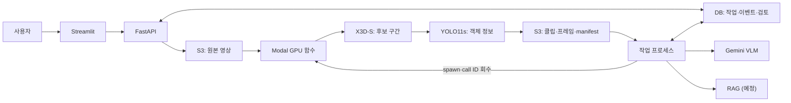

# CCTV Accident Detector

녹화된 CCTV 영상에서 **사고 의심 구간**을 찾고, 실제 장면·AI 설명·관련 문서를 묶은 **보고 초안**을 만든 뒤, 담당자가 원본을 보고 `사고 확인 / 사고 아님 / 판단 보류`를 기록하는 서비스입니다.

- 대상 사용자: 관제 담당자, 영상 검토자, 경찰·사고 대응 담당자 (첫 버전은 공통 검토 화면 하나)
- 목표와 범위 전체: [PRD v0.2](PROJECT_BRIEF.md)

## 현재 상태

| 영역 | 상태 |
| --- | --- |
| 설계 문서 | PRD, 공통 API·데이터 계약, 역할 문서 6종, 가상 응답 8종 |
| 화면 (`apps/streamlit/`) | FastAPI 영상 접수·작업 조회·원본/근거 자산·검토 저장 연결. 데모는 `APP_MODE=demo`일 때만 사용 |
| 백엔드 (`services/backend/`) | 공개 API, Modal 비동기 제출·회수, S3 manifest 검증, Gemini 설명 저장. 테스트는 가짜 S3·Modal·Gemini 사용 |
| 모델 추론 | 인계받은 YOLO11s·X3D-S 코드를 `src/accident_vision/`에 연결. 실제 GPU 로드·추론은 검증 전 |
| Modal GPU 함수 | `deploy/modal/app.py` 구현. 실제 Modal 계정·S3 가중치로 실행 검증 전 |
| RAG 문서 저장소 | 미연결. 항상 `insufficient_evidence/corpus_not_configured`로 표시 |

현재까지는 가짜 Modal 응답으로 화면·API 흐름을 확인했습니다. 실제 영상에서의 GPU 추론은 Modal 배포와 S3 가중치 연결 후 검증해야 합니다. GPU 입력·출력 기준은 [Modal 연결 계약](docs/contracts/modal-inference-v1.md), 실행 검증 기록은 [진행 기록](docs/PROGRESS.md)을 참고하세요.

## 동작 방식

영상 한 건은 다음 순서로 처리하도록 설계했습니다.

1. 사용자가 MP4를 업로드하고 분석을 요청하면 API가 `job_id / run_id`를 발급합니다.
2. 백엔드 작업 프로세스가 Modal GPU 함수를 비동기로 호출합니다. 함수는 업로드 영상을 오프라인으로 분석합니다.
3. **X3D-S**가 시간 창마다 사고 의심 점수를 계산해 후보 구간을 찾습니다.
4. 후보가 있을 때만 해당 장면에 **YOLO11s**(7개 클래스)를 실행해 객체 정보를 붙입니다.
5. Modal 함수는 클립·대표 프레임·manifest를 S3에 저장하고, 작업 완료 후 백엔드가 검증해 후보 event를 DB에 등록합니다.
6. 백엔드의 별도 작업 프로세스가 검증된 클립·프레임을 **Gemini**(VLM)에 보내 장면 설명을 받고, **RAG**로 출처 있는 사례·판례·지침을 찾아 보고 초안을 만듭니다.
7. 담당자가 원본과 설명을 확인하고 판단·메모를 저장합니다. AI 초안과 사람의 판단은 따로 보존합니다.

모델 점수는 검증된 사고 확률이 아니며, 표시되는 시각은 원본 영상 기준 초입니다. 처리 실패나 미처리 범위를 "사고 없음"으로 표시하지 않습니다.

## 아키텍처



| 구성 요소 | 역할 | 코드 |
| --- | --- | --- |
| Streamlit | 영상 접수, 작업 목록, 후보·보고 확인, 사람 검토 | `apps/streamlit/app.py` |
| FastAPI | 공개 API(`/api/v1/*`), 인증·멱등성 | `services/backend/app.py` |
| Modal 연동 | 작업 제출·결과 회수, manifest와 S3 객체 SHA256 검증 | `services/backend/modal_service.py` |
| 작업 프로세스 | Modal 회수와 Gemini 설명 생성·저장 | `services/backend/worker.py`, `run_worker.py` |
| 추론 패키지 | Modal이 사용하는 YOLO·X3D-S 오프라인 파이프라인 | `src/accident_vision/` |
| 저장소 | S3는 원본·근거 파일, PostgreSQL은 영상 메타데이터·작업·검토, SQLite는 테스트 | `storage.py`, `db.py`, `migrations/` |

자세한 연결 규칙은 [PRD 4장](PROJECT_BRIEF.md#4-서비스-구성), API는 [공통 계약](docs/contracts/service_contract.md)과 [HTTP API 명세](docs/contracts/api-spec-v0.2.md), VLM 출력 형식은 [VLM → RAG 입력 계약](docs/contracts/vlm-rag-input-v1.md)을 참고하세요.

## 실행 안내

팀원이 `develop`을 받아 Docker만으로 시작하려면 [팀 로컬 빠른 실행](docs/TEAM_LOCAL_QUICKSTART.md)을 참고하세요.
클라우드 없이 화면만 확인하는 Compose와, `.env` 설정 후 DB·RAG 초기화까지 처리하는
`scripts/start_local.ps1`을 제공합니다.

### 1. 설치와 테스트

Python 3.13과 [uv](https://docs.astral.sh/uv/getting-started/installation/)를 설치한 뒤 저장소 루트에서 실행합니다. `uv sync`가 `.python-version`에 맞는 Python과 `.venv`를 준비하고, `uv.lock`에 고정된 버전을 설치합니다.

```bash
git switch develop
git pull --ff-only
uv sync --locked --group dev
uv run --locked pytest -q
```

테스트는 SQLite와 가짜 S3·Modal·Gemini·ffprobe를 쓰므로 클라우드 계정이나 API 키 없이 실행됩니다.

### 2. Streamlit 화면

기본 실행은 실제 FastAPI 연결을 요구합니다. `BACKEND_API_URL`과 `APP_API_KEY`를 설정하면 영상을 S3에 접수하고 작업·검토를 PostgreSQL에 저장합니다. 화면 상태만 점검할 때는 `APP_MODE=demo`를 명시하면 가상 응답(`docs/contracts/demo-analysis-cases-v0.2.json`)을 읽습니다.

```bash
uv run --locked --group dev streamlit run apps/streamlit/app.py
```

브라우저에서 `http://localhost:8501`을 엽니다.

- 로컬 영상을 최대 5개까지 올리면 영상 카드 목록이 나오고, 카드를 누르면 분석 화면으로 이동합니다.
- 분석 화면에서 가상 응답 8종(대기, 분석 중, 후보 없음, 부분 완료, 설명 생성 중, 문서 근거 부족, VLM 실패, 전체 실패)을 바꿔 볼 수 있습니다.
- API 모드에서는 작업과 검토 결과를 DB에 저장하며, 데모 모드에서는 검토 결과를 현재 세션에만 저장합니다.

화면과 API의 로컬 연결 범위는 [Streamlit–FastAPI 연동 안내](docs/STREAMLIT_BACKEND_LOCAL.md)에 있습니다.

### 3. 백엔드 API 로컬 실행

로컬에서는 PostgreSQL을 실행하고 실제 S3·Modal·Gemini를 연결해 전체 흐름을 확인합니다. 해당 서비스의 자격 증명이 필요합니다. 전체 순서는 [백엔드 로컬 실행 안내](services/backend/README.md#로컬-postgresql과-실제-s3-연결)를 참고하세요.

1. `ffprobe`(FFmpeg)를 설치합니다.
2. `.env.example`을 `.env`로 복사해 `APP_API_KEY`, PostgreSQL·실제 S3·Modal·Gemini 설정을 채웁니다. 앱은 `.env`를 자동으로 읽지 않습니다.
3. 두 터미널에서 각각 환경을 불러와 API와 작업 프로세스를 실행합니다.

```bash
# 터미널 1: API
set -a; source .env; set +a
uv run --no-sync uvicorn services.backend.app:create_app --factory --reload

# 터미널 2: Modal·Gemini 작업 프로세스
set -a; source .env; set +a
uv run --no-sync python -m services.backend.run_worker
```

`http://127.0.0.1:8000/health`로 상태를 확인할 수 있습니다. 공개 API는 `Authorization: Bearer <APP_API_KEY>`를 사용합니다. EC2 서비스 구성은 [Docker Compose 안내](deploy/compose/README.md), Modal 배포·가중치 설정은 [Modal 안내](deploy/modal/README.md), 전체 흐름 검증은 [Compose E2E 안내](deploy/compose/README.md#기동과-확인)에 있습니다.

### 4. 샘플 영상으로 사고 탐지 실행

> **실제 GPU 통합 검증 전입니다.** 코드는 연결했지만 Modal 앱 배포, S3 가중치와 자격 증명, 실제 영상 추론 확인이 필요합니다. 가중치는 저장소에 포함하지 않습니다.

인계받은 모델 묶음의 오프라인 추론 코드를 공통 패키지로 옮겼습니다([수신 모델 확인](docs/contracts/received-model-metadata-v0.2.json)). 필요한 준비물은 다음과 같습니다.

| 준비물 | 위치 |
| --- | --- |
| 가중치 파일과 SHA256 | 가중치는 전용 S3 버킷에 저장하고, 객체 키·SHA256은 Modal `cctv-s3` Secret에 설정 ([Modal 안내](deploy/modal/README.md)) |
| 추론 설정 | [`src/accident_vision/pipeline.py`](src/accident_vision/pipeline.py)와 [`timeline.py`](src/accident_vision/timeline.py)의 현재 설정값 |
| 실행 진입점 | [`deploy/modal/app.py`](deploy/modal/README.md), [`src/accident_vision/pipeline.py`](src/accident_vision/README.md) |
| 샘플 영상 | 저장소에 커밋하지 않음 (`*.mp4`는 `.gitignore` 대상) |

YOLO `Dynamic` 클래스의 정의와 화면 표시 정책, X3D-S 임계값 0.5의 실제 동작도 확인이 필요합니다.

## 저장소 구조

| 경로 | 내용 |
| --- | --- |
| `apps/streamlit/` | Streamlit 데모 화면 |
| `services/backend/` | FastAPI 백엔드와 Gemini 작업 프로세스 |
| `scripts/` | 실제 업로드부터 Modal·Gemini 결과까지 확인하는 E2E 스크립트 |
| `src/accident_vision/` | 로컬·Modal 공통 추론 패키지 |
| `deploy/modal/` | 가중치 S3 다운로드·해시 검증과 GPU 추론 배포 코드 |
| `training/` | YOLO11s·X3D-S 학습 설정과 평가 기록 |
| `tests/` | `unit/`, `integration/`, `smoke/` 테스트 |
| `docs/` | 계약, 역할 문서, 요구사항, 진행 기록 |

전체 구조와 파일 추가 시점은 [프로젝트 폴더 구조](docs/PROJECT_FOLDER_STRUCTURE.md)에 있습니다.

## 팀원 시작 안내

1. [PRD](PROJECT_BRIEF.md): 목표·범위·아키텍처
2. [공통 API·데이터 계약](docs/contracts/service_contract.md)과 [HTTP API 명세](docs/contracts/api-spec-v0.2.md): 작업 상태·요청/응답·오류·검토 저장
3. [역할 문서](docs/roles/README.md): FE·BE·모델·VLM/RAG·인프라·QA
4. [구현 계획](IMPLEMENTATION_PLAN.md)과 [진행 기록](docs/PROGRESS.md)
5. [팀 공유 안내](docs/team_handoff.md): 문서 읽는 순서와 편집 방법

API나 상태 값을 바꿀 때는 역할 문서보다 공통 계약을 먼저 수정합니다. 가중치, 영상, `.env` 같은 비밀 정보는 커밋하지 않습니다.
