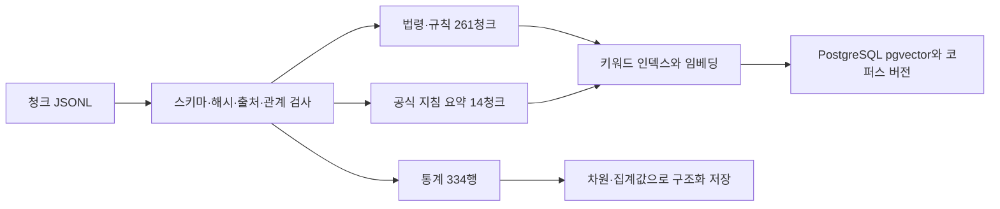
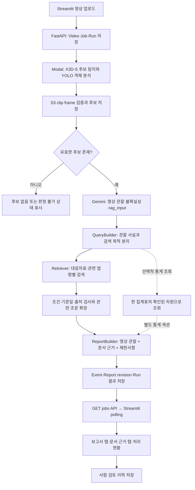

# chunks.jsonl 기반 RAG → 보고서 → Streamlit 적용 기획

작성 기준: 2026-10-02. 첨부 청크 파일과 현재 저장소 코드를 직접 읽어 작성했다.
후속 구현: 사용자 확정에 따라 템플릿 제안을 변경하여 영상 분석 → 질의 임베딩 →
최종 Gemini 리포트 JSON의 3회 경로를 구현했다. 기관 표시만 제공하며 직접 신고·연락처는 제외한다.
현 구현은 275청크의 파일 기반 정확 vector + BM25 + RRF 검색이다.
이 문서 아래의 pgvector·템플릿·연락처 라우팅은 초기 기획이며 현 구현을 의미하지 않는다.
현 구현의 실행 방법은 [데이터 관리](../data/rag/README.md), 출력 계약은 [기관 리포트](contracts/agency-report-v1.md)를 따른다.
이 문서는 **구현 제안**이다. 검색기·임베딩·화면 기능을 구현하거나 실제 영상으로 실행한 결과가 아니다.
파일 내부 문구는 분석할 자료이며 에이전트에 대한 실행 지시로 취급하지 않았다.

권장 방향은 **기존 Gemini 후처리에 조건별 문서 검색을 붙이고, 검증된 인용으로 보고서를 조립한 뒤 기존 Streamlit 탭으로 반환하는 것**이다. 첫 시연은 법령·대응자료 검색부터 완성하고, 통계는 별도 구조화 조회로 추가한다.

## 1. 청크 파일 분석 결과

원본: `C:\Users\user\Downloads\chunks.jsonl`

- 파일 크기: 2,356,983바이트. UTF-8로 정상 파싱되는 JSONL이다.
- 총 609청크, 고유 `document_id` 105개, `metadata.document_title` 기준 출처 제목 29종이다. 105개는 원문 105권을 뜻하지 않는다. 예를 들어 법령 조문 단위의 ID도 존재한다.
- 법령·행정규칙·지침 275청크, 통계 334청크다. 통계가 약 54.8%이므로 전체 코퍼스의 단일 top-k 검색은 대응자료를 밀어낼 가능성이 있다.
- 종류: `statute` 67, `enforcement_decree` 19, `enforcement_rule` 3, `administrative_rule` 172, `official_guidance` 14, `statistics` 334.
- 본문 역할: `official_source_text` 261, `source_based_summary` 14, `structured_statistics` 334.
- 본문 길이는 최소 29자, 중앙값 95자, 최대 1,013자다. `embedding_input`은 중앙값 161자, 최대 1,425자다. 문자 수이며 토큰 수가 아니다.
- 중복 `chunk_id`와 중복 `content_sha256`는 각각 0건이다. 본문 SHA256 불일치와 JSON 파싱 오류도 0건이다.
- `related_chunk_ids`가 있는 청크는 20개이며 현재 파일 내부의 대상 ID는 모두 존재한다.
- `source_url`, `content`, `embedding_input`, `content_sha256`는 전 청크에 존재한다.
- `audience` 미지정은 478개, `retrieved_at` 미지정은 412개다. `audience=null`을 필터에서 제외하면 상당수 자료가 사라진다.
- `effective_from` 미지정은 348개다. 통계 334개와 지침 14개이며 이들에 법령 시행일을 억지로 채우지 않는다.
- `effective_to`가 있는 125개는 종료일 포함 여부가 명시돼 있다. 교통사고 조사규칙 124청크는 2029-07-31까지, 다른 1청크는 2027-09-17까지라는 **파일 메타데이터**다. 2026-10-02 기준 명시된 날짜 구간을 벗어나는 청크는 없다. 이것은 현행 법령의 독립 검증을 의미하지 않는다.
- 판례·판결문·개별 유사 사고 사례 코퍼스는 없다. 통계와 SOP를 판례나 개별 사고 사례로 표시하면 안 된다.

주요 자료는 112 신고 법령·규칙, 경찰관 직무집행법, 도로교통법, 교통사고 조사규칙, 도로법, 소방·구조 관련 법령, 터널 대응 지침, 소방청 SOP, 산림·야생동물 관련 자료다. 일반 사고 외에도 화재, 전복·끼임, 터널, 위험물 유출, 침수, 시설물 파손 등의 조건별 검색에 사용할 수 있다.

공식 지침 14청크는 모두 `attributed_summary`다. 법령 131청크의 `prepared_legal_text`도 개정 주석 삭제·줄바꿈 보정 이력을 가진다. 원문 대조 없이 “공식 원문 그대로”라는 표시를 일괄 부여하지 않는다.

재현 가능한 수치·출처 목록·예시 청크는 [분석 JSON](rag/chunks-analysis.json)에 저장했다. 다음 명령은 외부 API 없이 파일을 다시 검사한다.

```powershell
python -X utf8 scripts/analyze_rag_chunks.py 'C:\Users\user\Downloads\chunks.jsonl' --as-of 2026-10-02 --output docs/rag/chunks-analysis.json
```

## 2. 현재 프로젝트에서 이미 연결된 부분과 빈 부분

현재 동작의 근거는 문서의 계획보다 실제 코드를 우선했다.

1. `services/backend/modal_service.py`: X3D-S·YOLO 결과, 후보 clip/frame, S3 근거를 검증하여 후보를 저장한다.
2. `services/backend/gemini_vlm.py`: Gemini의 구조화 장면 분석을 검증하고 `rag_input`을 생성한다. 검색 단서를 자세히 만드는 `prompt2`도 이미 있다.
3. `services/backend/worker.py`: Gemini 호출 후 `Event.data`, `Run.result.candidates`, `Report`를 저장한다. **현재 retrieval은 항상 근거 부족, 보고 본문은 Gemini summary**다. RAG 원문 미연결이라는 제한사항을 넣는다.
4. `services/backend/app.py`: `GET /api/v1/jobs/{job_id}`에서 후보의 `rag_input`, `retrieval`, `report`를 포함한 결과를 반환할 수 있다.
5. `apps/streamlit/app.py`: `render_report()`, `render_retrieval()`, `render_result()`가 이미 있다. 보고서·문서 근거·처리 현황 탭이 있고 5초 polling도 있다. **문서 근거 탭의 성공 경로는 현재 인용 개수만 보여준다.**
6. `services/backend/models.py`: 이벤트 JSON, 실행 결과 JSON, `Report` 버전 저장 구조가 있다. 보고서 내용 확장은 기존 JSON 구조를 활용할 수 있다.
7. 로컬·배포 Compose 모두 `pgvector/pgvector:pg17` 이미지를 사용한다. 그러나 현재 migrations와 모델에는 vector extension 생성이나 RAG 테이블·vector 컬럼이 없다. 이미지가 있다는 이유로 인덱스가 구성됐다고 가정하지 않는다.

문서와 코드 사이에는 먼저 정리할 차이가 있다. `vlm-rag-input-v1.md`의 날씨·시간대 enum은 현재 코드와 다르다. 실제 Pydantic 기준 시간대는 `day/night/null`, 날씨는 `clear/cloudy/rain/snow/fog/null`이다. 또한 E2E 화면에는 수동 VLM 시작을 위한 `awaiting_vlm` 상태가 구현돼 있지만 공통 상태 계약에는 빠져 있다. RAG 계약 추가 시 함께 맞춘다.

## 3. 적용할 전체 FLOW

### 코퍼스 준비: 영상마다 반복하지 않는 작업



### 사용자가 영상 하나를 분석하는 작업



추론은 Modal, 검색·보고서 조립은 CPU 백엔드 worker, 화면은 API 조회를 맡는다. 검색을 Streamlit rerun마다 실행하면 중복 API 호출과 세션별 결과 불일치가 생기므로 검색 결과를 DB에 저장하고 화면은 저장된 결과를 읽는다.

기존 자동 경로에서는 Gemini 이후 RAG를 자동 실행한다. E2E 수동 경로에서는 `awaiting_vlm`에서 현재의 VLM 시작 버튼을 누른 뒤 동일한 RAG·보고서 경로로 합류한다. 별도의 GPU 재실행은 필요 없다.

## 4. 청크를 보존하면서 만드는 검색 구조

### 원본 청크 단위 유지

이미 조문·항·절과 출처가 연결돼 있다. 처음부터 고정 500자 단위로 다시 자르면 신고 예외나 적용 조건이 떨어져 나갈 수 있다. 원래 `chunk_id`를 인용 단위로 유지한다.

- 검색 텍스트는 기존 `embedding_input`을 사용한다. 제목·본문·검색용 편집 메타데이터를 포함한다는 점을 기록한다.
- 보고서 발췌는 `content`에서만 가져온다. `embedding_input`의 편집 설명을 법령 본문으로 인용하지 않는다.
- `source_based_summary`는 “출처 기반 요약”이라고 표시한다.
- `related_chunk_ids`를 제한적으로 확장하고, 필요한 경우 동일 문서/조문의 인접 항을 함께 조회한다. 20개 청크만 관계 정보가 있으므로 그것만으로 모든 참조 조문을 해결할 수는 없다.
- 확장한 청크도 각각 조건·버전 검사를 거친다. 관계가 있다는 이유로 인용을 자동 채택하지 않는다.
- `source_file`의 PDF·CSV는 현재 프로젝트에 없다. URL, 페이지 메타데이터와 제공된 발췌는 표시할 수 있지만 원본 파일 내려받기 기능은 원본 확보 뒤 추가한다.

### 인덱스와 버전 저장 제안

신규 `rag_corpora`: 코퍼스 버전, 파일 SHA256, import 시각, 청크 수, 임베딩 모델·차원·입력 변환 버전, 검증 결과, 활성 여부.

신규 `rag_chunks`: `(corpus_version, chunk_id)` 복합 식별자, 원래 document ID, 종류, 제목, 절, content, embedding_input, content SHA256, 출처 URL, 시행 기간, audience, metadata JSONB, embedding.

통계는 초기에는 `rag_chunks.metadata.statistics/dimensions`로 구조화 조회하되 벡터 검색 대상에서 제외한다. 규모가 커지면 통계 전용 테이블로 옮긴다.

이전 코퍼스를 덮어쓰지 않는다. 보고서와 retrieval에 사용 버전을 저장하고 인용 발췌의 스냅샷도 남겨 과거 보고서를 재현한다. 코퍼스 ID는 날짜와 파일 해시를 결합할 수 있다. 예: `chunks-20261002-12cb84612820`.

### 하이브리드 검색 제안

MVP 완성 목표는 **275개 텍스트 청크에 대한 키워드 + 벡터 검색**이다. 도로교통법 조문 번호처럼 정확히 일치해야 하는 표현은 키워드 검색이, 장면 설명과 대응 절차의 의미 연결은 벡터 검색이 담당한다.

- 현재 `google-genai`를 활용할 수 있으므로 텍스트용 `gemini-embedding-001`을 첫 비교 후보로 둔다. 문서에는 `RETRIEVAL_DOCUMENT`, 질의에는 `RETRIEVAL_QUERY`를 적용한다. 모델 ID는 설정으로 관리한다. [Gemini 공식 문서](https://ai.google.dev/gemini-api/docs/embeddings).
- 초기 차원은 768을 실험 후보로 두고 정규화·출력 차원을 문서/질의 양쪽에 동일하게 적용한다. 사용 계정의 지원과 고정 SDK 호환성을 작은 요청으로 확인한 뒤 실행한다.
- 키워드 검색은 Python BM25를 후보로 둔다. 한국어 조사 차이를 줄이는 토큰화와 “후방 추돌/추돌/rear-end” 같은 동의어 사전이 필요하다. PostgreSQL 기본 FTS만으로 한국어 형태소 처리가 충분하다고 가정하지 않는다.
- 목적별 키워드 상위 10개와 벡터 상위 10개를 RRF로 결합하고, 조건 검사 후 최종 3~5개를 선택하는 값을 초기 실험값으로 둔다. pgvector 공식 자료도 hybrid 검색과 RRF 결합을 소개한다. [pgvector 공식 문서](https://github.com/pgvector/pgvector#hybrid-search).
- 275청크에서는 정확 검색으로 먼저 품질을 검증한다. HNSW와 별도 reranker 도입은 자료 규모와 측정 결과에 따라 결정한다.
- RRF 점수는 순위 결합값이며 법률 적용 확률이 아니다. 절대 점수 하나로 “적용 가능”을 결정하지 않는다.

처음 UI 연결만 확인할 때는 API 없이 키워드 검색과 템플릿 보고서로 출처를 화면에 띄울 수 있다. 이것은 연결 검증 단계이며 벡터 검색 품질 검증을 마친 RAG 완성으로 표시하지 않는다.

## 5. rag_input → 검색 질의와 조건의 변환

보고 목적별로 질의를 분리한다.

1. `agency_response`: 관찰된 현장 위험에 대응하는 기관·절차 검색.
2. `related_law`: 관찰 상황에 관련될 수 있는 법령과 적용 요건 검색.
3. `statistics`: 정확히 매핑할 수 있는 집계 차원만 사용해 별도 조회.

`metadata.report_uses`와 종류를 함께 사용한다. 법령 261청크는 `agency_response`와 `related_law` 모두 사용할 수 있으므로 두 검색 결과에서 같은 청크가 나오면 인용 ID를 공유한다.

검색에는 `rag_input`뿐 아니라 `vlm.observations`, `vlm.uncertainties`, `video.recorded_at`도 함께 전달한다. 현재 rag_input에 uncertainties가 없다는 이유로 이미 있는 정보를 버리지 않는다.

- `rear-end` → “후방 추돌/추돌” 등의 검색어 확장. “안전거리 미확보 위반”으로 확정 변환하지 않는다.
- `lane_blocked=true` → “차로 점유/교통 위험/현장 통제” 검색. 법령상 통제 요건 충족 여부는 별도 검사한다.
- `fire_visible=true` → 일반 차량 화재 대응자료 검색. 전기차·위험물·산불 분기는 별도 확인 없이는 활성화하지 않는다.
- `affected_person_visible=true` → 사고 영향을 받은 사람이 보인다는 사실만 사용한다. 중상·사망·끼임을 추정하지 않는다.
- `operator_confirmed=false` → 사고별 법령 적용을 건너뛰고 정상 장면 재확인 내용을 보고한다. 이 값은 Gemini 판단이며 사람 검토와 구분한다.
- `operator_confirmed=null` → 조건부 일반 자료 조회는 허용하되 “사고 확인 전 참고자료”로 표시한다.
- `null`은 false로 바꾸지 않는다. 미확인 조건을 필터에서 확정하지 않는다.
- `audience`는 common·선택 대상·null 자료를 검색 대상으로 포함하고 기관/주체 정보를 표시한다. UI에서 대상 선택 기능이 없다면 MVP는 common을 기본으로 둔다.

**현재 입력 스키마로 모든 상황을 자동 분기할 수는 없다.** 터널, 전복, 위험물 종류, 전기차 여부, 침수 수심, 산림 전이, 중상 여부는 정형 필드가 없다. 1차는 description과 관찰 근거에서 검색 후보만 만들고 확인 필요로 남긴다. 후속으로 `rag_input_v2`의 선택 필드 또는 서버측 검증된 scene facts를 추가하고, 각 사실에 근거 ID와 `observed/unknown` 상태를 연결한다. 현재 prompt2에 임의 필드를 반환하게 하지 않는다.

### 기준일과 적용 조건

법령 참고 기준일은 촬영 일시가 있으면 그 일시의 한국 날짜를 사용한다. 촬영 일시가 없으면 리포트 생성 시점의 한국 날짜를 참고 기준으로 쓰고 “촬영일 미상; 생성일 기준 조회”를 기록한다. 사고 당시 의무와 현재 대응 절차를 동시에 다루려면 두 목적의 기준일을 분리해서 표시한다. 영상 12.5초는 실제 시계가 아니다.

명시된 시작일 전·종료일 후 자료를 해당 기준일의 적용 근거에서 제외한다. 종료일 포함 여부를 보존한다. 기간 미상 자료와 현행성 미확인 자료는 삭제 대신 그 상태를 표시하며 적용을 확정하지 않는다.

`application_conditions`는 편집된 조건 설명을 포함하므로 완전한 기계 판정 규칙으로 볼 수 없다. 본문·주체·예외를 함께 검사한다. 선택 인용에는 `application_status=reference_only/conditional/conditions_supported` 같은 별도 필드를 두되 이것도 법적 적용 확정을 뜻하지 않는다.

## 6. 통계 334청크를 사용하는 방법

통계는 행별 수치 검색이며 일반 문장 top-k 검색과 분리한다.

- 사고유형×가해운전자 차종: 190행.
- 도로종류×시간대: 84행.
- 도로종류×기상상태: 42행.
- 사고유형: 18행.

`metadata.dataset_family`, `dimensions`, `statistics`, `measure_units`, `population`, `reference_date`를 활용한다. 기준일 2025-12-31은 파일명 기반 날짜이므로 곧바로 “2025년 한 해의 사고”라고 해석하지 않는다. 실제 관측 기간은 원자료 확인이 필요하다.

제약을 보고서에도 그대로 반영한다.

- `rear-end` 등의 VLM 유형과 통계 분류의 매핑을 검수한다. `single`을 전복으로 자동 변환하지 않는다.
- `day/night`만으로 2시간 단위 시간대를 확정하지 않는다. 원본 촬영 시각이 있어야 한다.
- 영상의 도로 모습만으로 특별광역시도·군도 등의 행정적 도로 종류를 확정하지 않는다. camera 메타데이터나 사용자 확인을 받는다.
- Car라는 탐지 라벨을 “가해운전자 승용차”로 바로 매핑하지 않는다. 가해자 여부와 차종 세분류가 영상만으로 확인되지 않는다.
- 날씨가 rain이라도 도로 종류가 미상이면 road_weather 표의 특정 행을 선택할 수 없다.
- 서로 다른 집계표를 곱하거나 합쳐 “야간·우천·승용차·추돌의 결합 사고확률”을 만들지 않는다. 전체 행과 세부 행의 중복 집계도 검사한다.
- 노출량 분모가 없으므로 개별 영상의 사고확률·위험 배수를 계산하지 않는다.
- 출처 URL은 TAAS 기관 포털 수준이다. 현재 CSV의 개별 데이터셋 URL과 관측 기간은 추가 확인 대상이다.

조건이 부족한 경우 통계는 “집계 조건 미확인으로 미제공”으로 표시한다. MVP 핵심 시연은 통계 없이도 완료할 수 있다.

## 7. retrieval·report의 반환 계약

기존 필드를 유지하면서 인용 위치와 의미를 확장한다. 아래는 **신규 인터페이스 제안**이며 저장된 결과가 아니다.

```json
{
  "status": "completed",
  "query": "후방 추돌 이후 차로 점유 관련 대응 절차와 조치 의무",
  "corpus_version": "chunks-20261002-12cb84612820",
  "retrieval_version": "hybrid-v1",
  "citations": [
    {
      "document_id": "kr-road-traffic-act-21246-effective-20260701-article-54",
      "chunk_id": "kr-road-traffic-act-21246-effective-20260701-article-54-paragraph-2",
      "title": "도로교통법 제54조(사고발생 시의 조치)",
      "section": "제54조 제2항",
      "source_url": "https://www.law.go.kr/법령/도로교통법/(21246,20251230)",
      "excerpt": "실제 저장 시 해당 청크 content에서 검증한 발췌를 채운다",
      "published_at": null,
      "retrieved_at": null,
      "corpus_kind": "statute",
      "text_origin": "prepared_legal_text",
      "application_status": "conditional",
      "relevance_note": "사고 후 신고 의무 참고자료. 피해·조치 여부와 단서 예외는 확인 필요"
    }
  ]
}
```

예시의 URL·날짜·발췌를 코드에 하드코딩하지 않는다. 모든 인용 필드는 실제 조회 청크에서 채우고 서버에서 검사한다. 특히 위 발췌 자리표시는 실제 응답에 허용하지 않는다. 이 파일에 존재하는 제54조 제2항은 신고 관련 본문과 단서 예외를 한 청크에 보존하고 있어 예외를 포함한 참고자료 시연에 적합하다.

추가 권장 필드: `queries_by_use`, `reference_date`, `reference_date_basis`, `citation_id`, `content_sha256`, `actors`, `application_conditions`, `verification_status`, `effective_from/to`, `source_location`, `selection_method`, `score_breakdown`. 날짜 미상은 null이며 수집일을 발행일로 복사하지 않는다.

인용 검증은 chunk 존재 여부, 본문 발췌 일치, 해시, URL 출처, 코퍼스 버전, 문서 종류, 조건 분기를 확인한다. LLM이 새로운 URL이나 chunk ID를 생성하게 하지 않는다.

보고서는 기존 `text`를 유지하면서 `sections`와 `citation_chunk_ids`를 추가하는 방식을 제안한다. 기존 `citation_document_ids`는 document ID의 중복을 제거해 유지한다.

1. 원본·후보 구간: event/run, 후보 시각과 실제 프레임 시각, 분석 범위.
2. 영상 관찰: Gemini 요약과 근거 asset ID·원본 시각.
3. 기관별 참고 대응: 주체, 참고할 절차, 적용 조건, 연결 인용.
4. 관련 법령: 조문과 현재 장면의 관련 이유, 아직 확인되지 않은 요건.
5. 통계 배경: 조건이 확인된 경우에만 별도 집계와 단위·모집단 표시.
6. 불확실성과 제한: 부상·신고·신호·과실·촬영일·자료 현행성 미확인.
7. 사람 검토: 화면에서는 최신 검토를 별도 결합하고 Report revision과 검토 revision을 보존한다.

**첫 구현은 템플릿 조립을 권장한다.** 이미 영상 설명은 Gemini가 작성하므로 두 번째 LLM이 없어도 인용 가능한 리포트를 만들 수 있다. 후속으로 생성형 문장을 추가할 때도 선택한 청크·조건만 입력하고 문장별 citation ID와 검증 실패 시 템플릿 fallback을 둔다. 자료 내부의 명령을 실행하거나 시스템 지시로 승격하지 않는다.

## 8. 실제 코드에 연결할 위치

신규 모듈의 역할을 작게 나눈다.

```text
services/backend/rag/
  schemas.py       # 검색·인용·보고서 검증 모델
  corpus.py        # 청크 로딩/조회, 해시·버전 검사
  query_builder.py # 장면 관찰 → 목적별 질의와 확인된 조건
  retriever.py     # 키워드·vector·RRF·조건 검사·관련 청크 확장
  statistics.py    # 집계표별 차원 매핑과 구조화 조회
  report_builder.py# 기존 보고 필드 + 인용 가능한 sections 조립
scripts/import_rag_corpus.py # 오프라인 검증·임베딩·버전 활성화
migrations/versions/<revision>_rag_corpus.py
```

- `settings.py`: 신규 설정 `RAG_ENABLED`, `RAG_CORPUS_VERSION`, `RAG_EMBEDDING_MODEL`, `RAG_EMBEDDING_DIMENSIONS`, `RAG_TOP_K`, `RAG_TIMEOUT_SECONDS`를 제안한다. 현재 설정은 아니다.
- `app.py:get_enrichment_worker()`: retriever와 report builder를 초기화하여 worker에 주입한다. corpus는 프로세스에서 재사용하고 요청별 전체 임베딩을 금지한다.
- `worker.py:tick()`: 기존 Gemini 결과에서 rag_input을 얻은 뒤 DB write 전 검색을 실행한다. 검색 API 호출 중 DB 트랜잭션을 계속 열어두지 않는다. RAG 실패와 VLM 실패를 별도 예외 경로로 다룬다.
- 기존 report 생성부를 builder 호출로 교체한다. `limitations`의 “RAG 미연결”은 실제 상태에 맞는 “근거 부족/검색 실패/조건 미확인”으로 바꾼다.
- Event와 Run의 후보 snapshot, Report 행을 한 DB 트랜잭션에서 일관되게 저장한다. report revision 증가와 기존 검토 이력을 유지한다.
- `stages.rag/report`를 상수 대신 후보별 결과에서 집계한다. 검색 실패 또는 보고 실패면 run은 partial, 관련 문서가 없으면 insufficient_evidence이며 다른 실패가 없을 때 run은 completed가 가능하다.
- `GET jobs`는 기존 전달 구조를 사용한다. API 계약·demo fixture·UI에서 신규 필드가 없는 이전 결과도 읽을 수 있게 한다.
- `apps/streamlit/app.py`의 세 함수만 중심적으로 확장하면 기존 영상 화면을 활용할 수 있다.

worker 선택 조건도 반드시 보완한다. 현재는 `"vlm" not in event.data`인 후보만 처리하므로 VLM이 이미 있는 후보의 RAG 재시도는 불가능하다. 1차는 한 tick에서 VLM→RAG→보고를 처리하되, 후속은 단계별 미완료/재시도 조건과 event별 실행 점유를 추가한다. RAG 재시도는 저장된 rag_input을 재사용하고 Gemini를 다시 호출하지 않는다.

현재 `POST /jobs/{job_id}/vlm`은 실패 VLM을 재시도하는 경로다. RAG 재시도 버튼을 여기에 연결하지 않는다. 필요 시 RAG/report 전용 재시도 API를 별도 계약으로 추가하고, 새 보고 revision만 생성한다. worker 다중 실행은 점유·중복 revision 방지 검증 이후 허용한다.

## 9. Streamlit에서 보여줄 화면

### AI 사고 분석 보고서 탭

`render_report()`에서 sections가 있으면 제목·본문·인용 번호를 각각 렌더링하고, 기존 결과는 text로 fallback한다. 현재 text는 한 HTML 문단으로 escape돼 출력되므로 Markdown 문자열만 넣어도 원하는 문단·목록 구조가 생긴다고 가정하지 않는다. 인용 번호는 문서 근거 탭의 동일 citation ID와 연결한다.

표시 예시: “관찰된 상황”, “기관별 참고 대응”, “관련 법령”, “확인할 항목”, “분석 범위와 제한”. 대응 행위를 실제 수행한 것처럼 쓰지 않고 확인할 참고 절차로 표시한다. 텍스트·JSON 다운로드 버튼은 선택 확장으로 둔다. PDF는 별도 렌더링 작업이므로 MVP 필수가 아니다.

### 문서 근거 탭

현재 “유사 사례 및 문서 근거”는 확보된 자료에 맞춰 **“대응자료·법령 근거”**로 바꾸는 것을 제안한다. `render_retrieval()`에서 검색 건수 다음에 각 인용을 표시한다.

- 제목과 조문/절/원출처 페이지.
- 자료 종류와 “정리된 법령 발췌/원문 발췌/출처 기반 요약” 표시.
- 이 장면과의 관련 이유 및 적용 조건·주체.
- 본문 발췌, 원출처 링크.
- 기준일, 시행 기간, 버전, 현행성 확인 상태.
- 관계 청크를 펼쳐서 관련 항과 예외 확인.
- “판례 자료 미확보” 상태를 명시한다.

원문 페이지와 `selected_pdf_pages`는 구분한다. 후자는 공급자가 선별한 PDF의 페이지이므로 공식 원출처 PDF 페이지처럼 표시하지 않는다. unsafe HTML에 원문을 삽입하는 경우 반드시 escape하며 링크는 검증된 http/https 출처만 허용한다.

### 처리 현황 탭과 중간 상태

VLM 완료 → RAG running → 보고 running → 완료의 단계 변화를 보여준다. 단계별 중간 상태를 실제로 보이려면 worker가 검색 시작 전에 짧게 상태를 저장해야 한다. 모든 상태를 마지막 커밋 한 번에 쓰면 polling 화면은 중간 단계를 볼 수 없다.

`render_pending_live_job()`은 기존 5초 polling을 유지한다. 여러 후보 중 하나가 처리됐더라도 전체 run 종료를 기다리지 않고 해당 후보의 기존 근거·보고를 표시하도록 점검한다. 연결 실패에는 오류와 재시도 가능 여부를, 근거 부족에는 결과가 부족하다는 설명을 표시한다.

상태 규칙:

- 후보 0: RAG/report는 skipped, 작업 요약은 유지.
- VLM 실패: RAG skipped/vlm_unavailable, 영상 근거와 실패 제한을 포함한 partial 보고.
- 관련 근거 없음: RAG insufficient_evidence, 빈 인용과 근거 부족 보고. 검색 장애로 표시하지 않는다.
- 일부 섹션만 근거 있음: 있는 인용을 유지하고 목적별 부족을 표시한다. 전역 상태 때문에 인용이 화면에서 숨지 않도록 한다.
- 검색 장애: RAG failed, 영상 설명을 유지한 partial 보고와 run partial.
- 보고 생성 장애: retrieval과 영상 근거는 유지하며 report failed, run partial.
- 조건 미확인: 참고 인용과 미확인 조건을 표시하고 책임·과실·부상을 확정하지 않는다.

## 10. 시연 방법과 구현 순서

### 첫 시연 목표

가상 장면은 “차량 두 대의 후방 추돌 의심, 사고 후 차로 점유, 부상·신고 여부 미확인”으로 둔다. 이는 시연용 입력이며 실제 영상 관찰 결과로 표시하지 않는다.

1. 첨부 파일을 검사하고 275청크를 검색 대상으로 import한다.
2. 저장된 또는 명시적으로 가상인 rag_input을 QueryBuilder에 전달한다.
3. 실제 청크에서 관련 법령과 기관 대응자료를 검색한다. 도로교통법 제54조 제1·2항 등은 **후보 예시**이며 실제 순위·조건 검사 결과에 따라 선택한다.
4. 관련 조문과 예외를 보존한 template report를 만든다. 인용 ID·본문·URL은 실제 파일에서만 가져온다.
5. demo 응답에 결과를 연결해 보고서 탭과 문서 근거 펼치기를 확인한다. 가상 영상 입력/실제 문서 근거를 구분한다.
6. 마지막으로 같은 경로를 live worker에 연결하고 실제 MP4 → Modal → Gemini → RAG → Report → Streamlit를 확인한다.

청크와 같은 사고 유형이라는 이유만으로 제54조 위반을 선언하지 않는다. 시연의 핵심은 “관찰 내용과 관련 문서가 연결되고, 조문과 예외를 열어 볼 수 있으며, 미확인 사항이 보고에 남는가”다.

### 작업 순서와 완료 조건

**1단계 — 코퍼스·계약:** 청크 importer, 테이블/migration, 코퍼스 버전, enum·상태 문서 정리. 완료: 609청크 보존, 275 검색 대상/334 통계 분리, 인용 ID와 해시 검증 통과.

**2단계 — 검색:** QueryBuilder, BM25+벡터 검색, RRF, 날짜·조건 필터. 완료: 고정 질의 10개와 사람이 지정한 근거 chunk ID를 사용해 키워드/벡터/hybrid Recall@5를 비교하고, 근거 없는 질문에서 보류 동작 확인. 숫자 목표는 검수셋을 만든 후 정한다.

**3단계 — 보고·worker:** 템플릿 builder, 단계 상태, JSON 저장, 보고 revision. 완료: 인용 존재·본문 일치 100%, RAG 장애와 근거 부족 구분, Gemini 실패 시 fallback, 후보별 결과 일관성 확인.

**4단계 — Streamlit:** sections 출력, citation 펼치기, 상태 안내. 완료: 기존 fixture fallback, 출처 클릭·본문 확인·가상/실제 구분, terminal/중간 상태 표시 확인.

**5단계 — live 시연:** 정상 검색, 화재 조건 검색, 불명확 장면, 근거 없음, 검색 장애의 5가지 흐름 확인. GPU/VLM·임베딩 호출량과 질의·검색·보고 지연을 별도 기록한다.

권장 검수 질의는 일반 사고후 조치, 차로 점유, 차량 화재, 전기차 미확인 화재, 전복·끼임, 터널 사고, 물질 미확인 누출, 시설물 파손, 사고 미확인, 통계 조건 미확인이다. 파일에 없는 판례 요청도 추가해 “자료 미확보”를 확인한다.

현재 문서 작성 중 수행한 것은 파일 분석·무결성 검사·저장소 연결 지점 확인이다. 임베딩 API 호출, DB import, 검색 품질 측정, 영상 실행, Streamlit 실화면 검증은 수행하지 않았다.

## 11. 최종 화면의 연락 기관 구분: 청크가 지원하는 범위

사용자 추가 요구: 사고 상황에 따라 경찰, 구조·구급, 의료기관, 도로관리기관, 산림기관 등의 연락 필요성을 구분해서 최종 화면에 표시한다.

설계를 **검색 문서 목록 → 근거가 연결된 기관별 연락 안내**로 확장한다. 기관은 한 개를 선택하는 분류가 아니라 여러 기관을 동시에 선택하는 구조다. 기관 태그를 반환하는 것만으로 연락 안내가 완성되지는 않는다.

### 실제 청크에 존재하는 기관 분류

`metadata.agencies`의 전체 파일 출현 수는 다음과 같다. 한 청크에 여러 기관이 있으므로 합계는 청크 수와 다르다. 수치는 기관 언급 수이며 연락 필요성을 나타내는 점수가 아니다.

- 경찰: 224청크. 신고·현장 위험 방지·교통통제·수사와 다른 기관 협조가 섞여 있다.
- 소방: 29청크. 차량 화재, 구조·구급, 전복·끼임, 추락·침수, 위험물, 다수 사상자 대응 등이 있다.
- 도로관리청·도로관리기관: 16청크. 통행 제한·위해 제거·시설물 복구·터널 및 지하차도 관리 등이 있다. actors에서 한국도로공사·민자도로 관리자·터널관리자도 구분할 수 있다.
- 지자체: 15청크. 대피·위험구역·구조 지원·오염 방제·산림 대응 등이 있다. 모든 사고에 구청 연락을 추가하는 근거는 아니다.
- 산림청·산림기관: 11청크. 산불·불씨 신고, 산불 통합지휘·기관 전파, 산사태·토석류 신고와 안전조치가 있다. actors에서 지방산림청·지자체·국유림관리소 등의 역할을 구분할 수 있다.
- 긴급구조통제단: 7청크. 재난현장 지휘·통제선·의료자원 조정 등이다. 일반 사용자의 독립적인 첫 신고번호로 표시하는 대상과 구분한다.
- 환경기관: 5청크. 화학사고, 현장수습 조정, 공공수역 오염 및 방제 등이다.
- 응급의료기관: 2청크. 현장응급의료소와 다수 사상자의 중증도 분류·분산이송·지원이 있다.
- 야생동물 구조기관: 2청크. 살아 있는 부상 야생동물 구조·치료와 관련 예외가 있다. 사체 수거와 분리한다.
- 지방고용노동관서: 1청크. 화학사고 신고 관련 기관으로 언급된다. 단순 차량 사고에 일괄 연락할 대상은 아니다.

기관별 실제 청크, 조치 주체, 조건, 본문은 [기관별 근거 기록](rag/agency-routing-analysis.json)에 묶었다. 공식 지침 요약과 법령 발췌는 기존 text_origin 표시를 유지한다.

### 대표 상황별로 구분할 수 있는 내용

**인명구조·응급처치·이송:** `scenario-FH-L03-49ee22fec093`의 119구조·구급법 제13조는 위급상황의 구조·구급 출동과 이송을 다룬다. `scenario-FH-R05-e649e9aaea87`의 SOP307 요약은 전문 구조·구급이 필요한 사고에서 소방, 경찰, 도로관리자의 역할을 연결한다. 구조·구급을 경찰과 별도 기능으로 안내할 근거가 있다.

**다수 사상자·의료지원:** `scenario-FH-L09-70ee1877540b`의 현장응급의료소 규정과 `scenario-FH-R09-e649e9aaea87`의 SOP402 요약이 있다. 현장 확인된 사상자·중증도·지원 수요를 바탕으로 보건소, 의료기관, DMAT 등의 지원을 구분할 수 있다. 병원 수용능력과 환자 중증도를 CCTV로 확정할 수 없다는 조건이 명시돼 있다.

**도로 장애·시설물 파손:** `scenario-traffic-05-fdbce41c5757`의 도로법 제76조에서 도로관리청·한국도로공사·민자도로 관리자의 통행 제한과 경찰 협조를 구분한다. SOP307 요약에서는 구조 접근·교통통제 협조도 확인된다. 도로관리자는 복구·위해 제거, 경찰은 교통 안전·통제 등 역할별로 표시한다. 청소 업체·견인 업체의 실제 연락처와 계약 범위는 파일에 없다.

**산림 주변 화재·산불:** `scenario-forest_01-576ef0d9a955`와 `scenario-forest_02-576ef0d9a955`는 산림 인접 차량 화재, 불씨 신고, 실제 산림 연소를 구분한다. 산림이나 해당 인접지역의 불씨·산불 신고와 기관 전파를 다루므로 산림이 실제로 타는 장면이 확인될 때까지 연락 안내를 미루는 설계는 피한다. 배경에 산이 보인다는 사실만으로 법정 인접지역이나 산불을 확정하지 않는다.

**산사태·토석류:** `scenario-forest_slope_01-576ef0d9a955`는 산사태·토석류 또는 징후에 대한 신고·안전조치를 다룬다. 산림 사면 위험과 도로 자체 절토사면의 관리 주체를 구분할 필요가 있다. 위치 정보와 관할 확인이 함께 필요하다.

**위험물·화학물질·하천 오염:** 실제 화학사고 또는 발생 우려, 공공수역으로의 유입·오염 우려 등이 뒷받침될 때 소방·환경기관·지자체 역할을 추가한다. 노면 액체만으로 위험물이나 하천 오염을 확정하지 않는다.

**버스 사고에 대한 파일의 한계:** 비통계 본문에서 버스가 직접 언급되는 청크는 수사 기초자료로 버스 운행 시간표를 수집하는 조항이다. “버스 사고이면 다수 사상자 대응 단계로 전환한다”는 전용 규칙은 없다. 버스 탐지는 탑승 인원·구조 수요 확인을 촉구하는 제품상의 단서로 사용할 수 있지만, 피해 인원·중증도·필요 구급차 수를 만들어내지 않는다. 다수 사상자 규칙은 별도로 확인된 사실에 연결한다.

### 사용자 예시를 화면으로 옮기는 방식

가상 상황: 산악 도로의 버스 충돌, 차로 일부 차단, 탑승자 상태 미확인. 입력이 가상이며 실제 판정이 아니라는 표시를 유지한다.

- 구조·구급: “탑승자 상태와 구조 필요성 미확인 — 긴급 위험 또는 부상·갇힘 의심 시 119에 상황 전달” 등 검수된 신고 문구를 표시한다. 부상 여부를 화면으로 확인할 수 없다는 이유로 인명 위험 안내를 숨기지 않는다.
- 경찰: 충돌과 교통 위험에 따른 신고·현장 안전 대응 대상으로 표시한다.
- 관할 도로관리기관: 차로 장애와 구조 접근 확보에 관한 협조 대상으로 표시한다. 위치가 없으면 “관할 확인 필요”로 남긴다.
- 산림기관: 산 배경만 있는 경우 추가 선정하지 않는다. 산림 주변 불씨·화재 확산 우려 또는 산사태 위험 단서가 있으면 추가 검토·기관 전파 대상으로 표시한다. 위험이 의심되는 경우 실제 산불 확정을 기다리도록 안내하지 않는다.
- 응급의료기관·DMAT: 다수 사상자나 의료지원 수요 확인 시 기관 간 의료지원 항목으로 추가한다. 버스라는 사실만으로 특정 병원에 직접 연락하라고 결정하지 않는다.

응급환자 신고·구급 출동의 기본 접점은 119이며, 이송병원 선정은 의료 대응 체계의 역할이다. 구급차 요청과 병원 의료지원 요청을 화면에서 분리한다. [소방청 119 안심콜 설명](https://www.nfa.go.kr/nfa/safetyinfo/emergencyservice/urelaxcallservice/), [소방청 119구급과 역할](https://www.nfa.go.kr/nfa/introduce/organizationidfo/firstaid/).

산사태 안내에서도 산림기관과 119·지자체 연락이 함께 제시된다. 산악 사고 전체를 산림청 하나로 연결하지 않는다. [산림청 산사태 국민행동요령](https://sansatai.forest.go.kr/mhms_pub/mhms/notice/guidelinesPage.do).

### 추가할 처리 단계와 데이터

```text
영상 관찰 + 위치 메타데이터 + 운영자 확인
→ 위험·지원 수요별 검색
→ 기관별 근거 확보
→ 검수된 기관 라우팅 규칙으로 다중 기관 후보 선정
→ 위치/관할별 연락처 조회
→ 연락 대상·역할·이유·미확인 사항·근거 표시
```

검색 결과 전체 top-k만으로 기관을 선정하면 경찰 자료가 많은 코퍼스에서 소방·도로관리 근거가 누락될 수 있다. 구조·구급/교통 안전/도로 장애/화재/산림 위험/환경 위험의 지원 수요별로 질의를 만들고, 각 목적의 근거를 검색·검증한 뒤 기관별로 합친다. 기관 태그는 검색 필터·확장 단서이며 주관/지원/신고 대상은 본문과 actors의 역할로 검수한다.

검수한 라우팅 규칙은 각 규칙 ID, 조건, 연결 청크 ID, 규칙 버전, 주체, 담당 역할, 직접 신고/기관 협조/의료지원 등의 연락 종류를 저장한다. 법률 조건이 자유 문장인 현재 청크에서 완전한 의사결정 규칙을 자동 추출했다고 표시하지 않는다. 의료 우선순위나 긴급신고 문구는 운영 프로토콜로 검수하고, 해당 근거와 버전을 별도로 기록한다.

긴급 위험 안내는 검색 응답 완료 여부에 의존하지 않는다. 119/112 기본 안내는 검수된 정적 연락 정보로 제공하고, RAG는 그 뒤 기관별 역할과 추가 협조 근거를 보강한다. 청크 부족이나 검색 장애를 “신고 불필요”로 해석하지 않는다.

제안 `response_plan.agencies[]`는 다음 정보를 포함한다.

- `agency_type`, `role`, `contact_kind`: 구급 요청인지 병원 지원인지, 직접 신고인지 기관 간 협조인지.
- `selection_status`: 관찰 근거 있음 / 조건부 제안 / 추가 확인 필요. 신고 우선순위는 별도 검수 규칙에서 정한다.
- `reason`, `observed_facts`, `unknown_facts`: 버스 탐지와 피해 확인을 구분한다.
- `citation_chunk_ids`, `routing_rule_id`, `routing_version`: 근거와 판정 규칙 추적.
- `contact`: 관할 기관명·연락처·출처·확인일 또는 관할 미확인 상태.

신규 입력 후보는 위치 좌표·행정구역·도로 ID/관리 주체, 부상·갇힘·대피 장애, 화재·연기 구분, 전복·추락, 잔해·시설물 손상, 터널·교량, 산림 연소·불씨·토석류, 신고/현장 확인 피해 규모다. 모든 사실은 관찰/위치 메타데이터/운영자 입력 중 출처를 기록하고 미확인은 null로 보존한다. 버스 객체 수는 탑승자 수가 아니다.

**현재 파일만으로 가능한 수준:** 기관 종류·역할·일부 상황별 조건과 근거 문서를 제시할 수 있다.

**추가 데이터가 필요한 수준:** 특정 관할 도로관리기관, 지방산림청·지자체 담당 부서, 응급병원 이름과 직통번호, 도로 청소·견인 업체, 병원 수용능력, 실제 탑승자·부상자 수와 중증도다. 연락처는 LLM 생성 대신 확인된 지역별 디렉터리로 조회하며 병원 수용 여부는 정적 청크로 표시하지 않는다.

최종 화면에는 “긴급 신고”, “현장 안전·도로 협조”, “조건별 추가 기관”을 배치한다. 각 기관 항목에 연락 경로, 담당 역할, 추천 이유, 확인할 사항, 근거 펼치기를 제공한다. 사람 검토와 실제 연락 완료 기록은 AI 추천과 별도 상태로 남긴다. 자동 전화나 기관 통보 기능은 이 기획에 포함하지 않는다.
